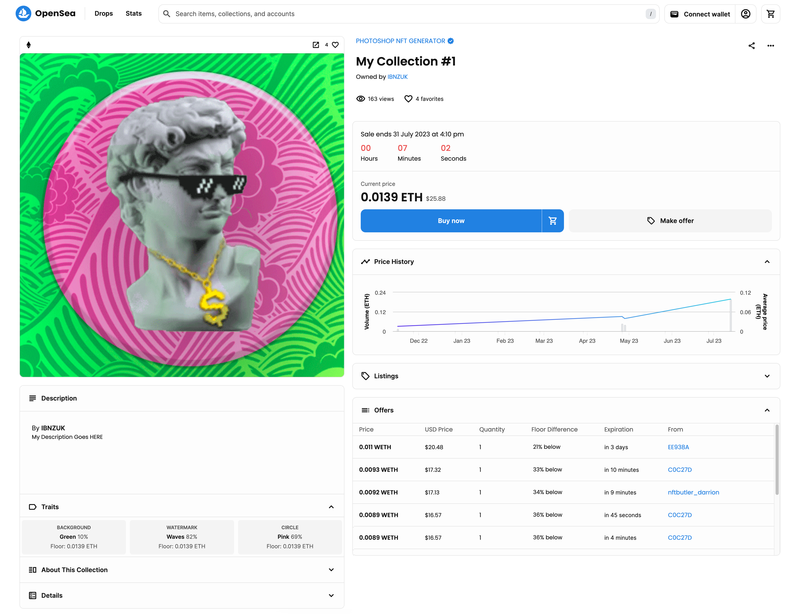
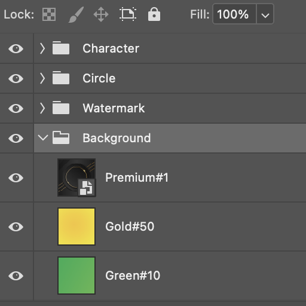
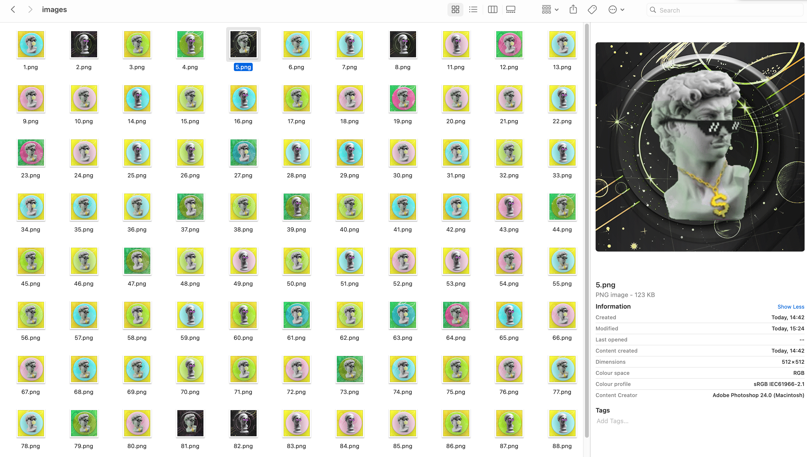

# PHOTOSHOP NFT GENERATOR

This script generates NFT art from a Photoshop file based on layer groups and traits.



## Instructions

1. Place your `.psd` file in the 'PHOTOSHOP NFT GENERATOR' folder. 
2. Each attribute should be in a separate group of layers. 
For example, you could have groups named "Background", "Watermark", and "Character". 
3. Within each group (attribute), each layer represents a different trait value. For instance, the "Background" group could have layers named "Green#10", "Blue#50", and "Premium#1". This would mean that your NFT could have traits such as 'Background - Green', etc.


`The number #10 next to your layer name means there is a 10% chance that this trait value will be used. Making it #100 does not guarantee that this value is used. It is a good idea to first try out your collection generation and adjust rarity values accordingly. #0 would mean this trait is not used.`



## Usage

1. **Generate NFT Images from Photoshop**
   In Photoshop, go to File -> Scripts -> Browse -> navigate to PHOTOSHOP NFT GENERATOR -> and select `CreateNFTs.js`

2. **Update Metadata Fields**
   In Photoshop, go to File -> Scripts -> Browse -> navigate to PHOTOSHOP NFT GENERATOR -> and select `UpdateMetadata.js`

`Your NFT collection will be created in the `/collection` directory. `

 
 

## Metadata

Your metadata structure will look similar to this:

```json
{
    "name": "My Collection #1",
    "description": "My description goes HERE",
    "image": "https://myURL.com/1.png",
    "edition": 1,
    "attributes": [
        {
            "trait_type": "Character",
            "value": "Male"
        },
        {
            "trait_type": "Watermark",
            "value": "Waves"
        },
        {
            "trait_type": "Background",
            "value": "Green"
        }
    ]
}
  
